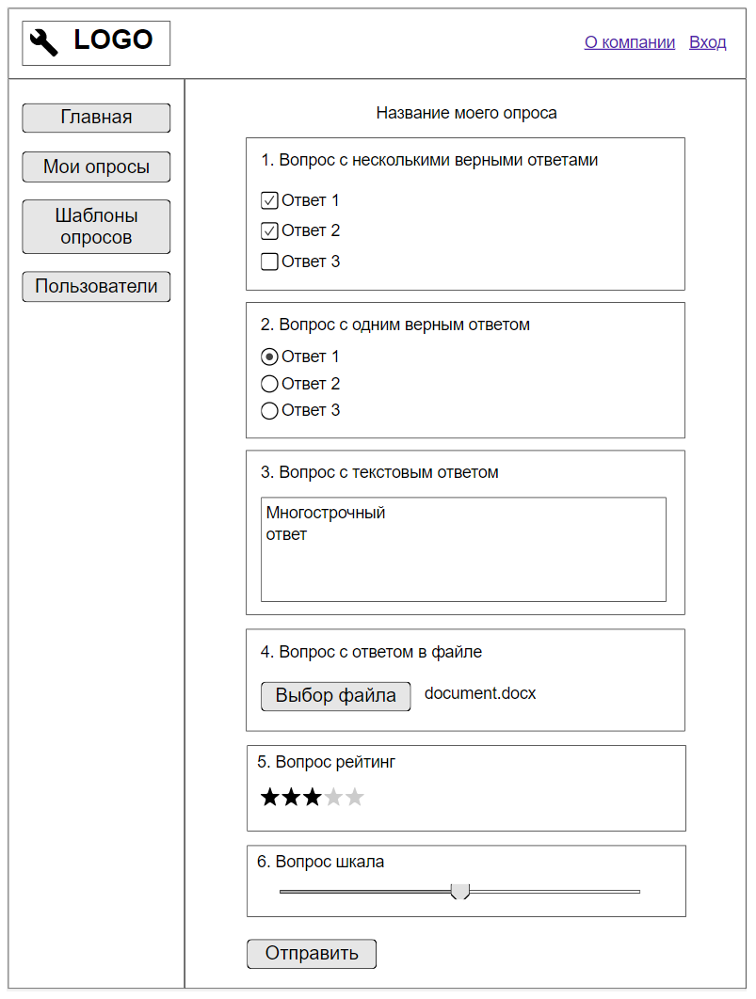

#### Week #1

##### Задание 1:

Реализовать функцию curry таким образом, чтобы выполнялось:

```js
function abc(a, b, c) {
  return a + b + c;
}

function abcdef(a, b, c, d, e, f) {
  return a + b + c + d + e + f;
}

abc.curry('A')('B')('C'); // 'ABC'
abc.curry('A', 'B')('C'); // 'ABC'
abc.curry('A', 'B', 'C'); // 'ABC'

abcdef.curry('A')('B')('C')('D')('E')('F'); // 'ABCDEF'
abcdef.curry('A', 'B', 'C')('D', 'E', 'F'); // 'ABCDEF'
```

##### Задание 2:

```
Реализовать функцию, создающую глубокую копию (deep copy) объекта без использования JSON.stringify
```

#### Week #2

##### Задание 3:

```
Разработать веб страницу, согласно прикрепленному макету.
При разработке использовать flexbox.
Запрещено использовать тег .
Запрещено использовать сторонние библиотеки.
При нажатии на кнопку "Отправить" вывести в консоль выбранный ответ каждого элемента опросника.
При разработке разместить проект в трех файлах "index.html", "script.js", "style.css"
```



